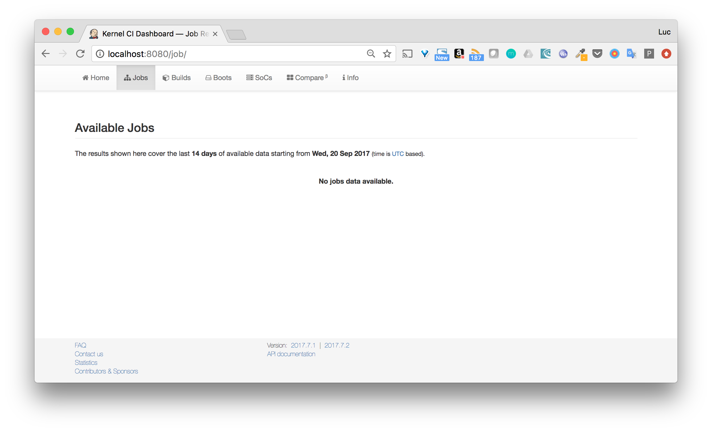

KernelCI Docker
===============

## Purpose

This repository eases the installation process of KernelCI through the usage of Docker containers.

It uses docker-compose to run the services involded

- reverse-proxy
- frontend 
- backend
- celery task queue
- redis
- mongo

## Usage

The startup of the application is done in several steps:
- start the application
- generate an access token from the api
- set this token in the frontend configuration file
- restart the frontend

You can do all the steps manually as described below, or you can run the start script which handles all of them:

```
./start.sh
```

### Start the application

Once you have cloned the repository, the first step is to build the images so they are present locally.

```
docker-compose build
```

The application can then be started with the following command:

```
docker-compose up -d 
```

This command starts all the services.

Note: as some services depend upon some other ones, they might restart several times waiting for their dependencies to be ready.

### Generate an access token

Once the API is up and running, it's available on port 8081 (temporary port that will be changed soon once the reserve proxy is configured with subdomains).

We can now use the API to create an admin token from the MASTER_KEY.

```
curl -X POST -H "Content-Type: application/json" -H "Authorization: MASTER_KEY" -d '{"email": "me@gmail.com", "admin": 1}' localhost:8081/token
{"code":201,"result":[{"token":"fd229997-944d-41f3-884f-c4c8b1cd67af"}]}
```

Note: this admin token can then be used to perform any api calls. One of the first action should be to create some non admin tokens in order to perform non admin actions. To keep thing simple, we'll provide the admin token to the frontend (will be changed later on).

### Configuration of the frontend

In this step, we use the token generated above and set it in the *BACKEND_TOKEN* in the *etc/flask_settings*. As this file is bind-mounted from the host, the value of the token will be taken into account by the frontend container.

### Restart the frontend

We then need to start the frontend with the following command:

```
docker-compose restart frontend
```

The web ui is then available on port 8080.


As the installation has just be done, there are no other resources (jobs, ...) available yet.



## Status

This is a work in progress [WIP], currently not fully functional.

Several features need to be added:
- to be aligned with the official KernelCI
- to improve and simplify the deployment and architecture of the whole application

Among the ongoing changes:

- [x] Automate the setup (create token from master key, provide token to frontend)
- [ ] Add some tests
- [ ] Check storage part
- [ ] Add api documentation
- [ ] Add elasticsearch and modify backend so log files are sent to ES
- [ ] Configure reverse proxy (routing with subdomains, TLS termination, ...)
- [ ] Add front and back networks to isolate the services
- [ ] Add stack file to deploy the application on a Swarm
- [ ] Usage of env variable or Docker secret to provide the backend token

